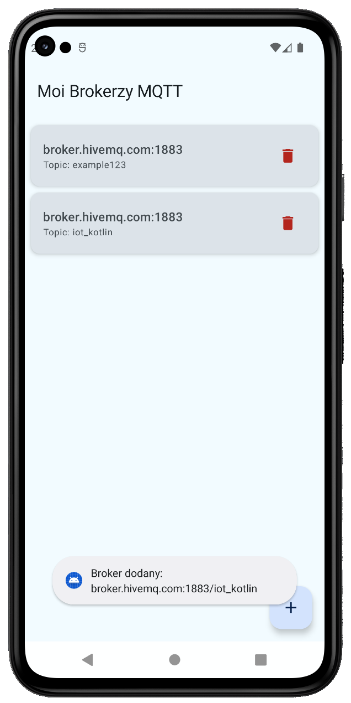
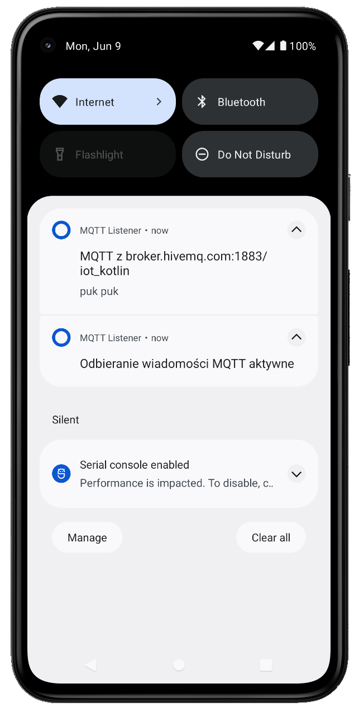

# MQTT Listener

MQTT Listener is an android mobile application to monitor messages published by selected MQTT brokers. Users can add and remove brokers, which allows them to subscribe to specific topics. The app runs seamlessly in the background, ensuring real-time notification delivery of incoming messages.

## Key technologies and libraries

* Kotlin
* Jetpack Compose
* SQLite
* Room Database
* Eclipse Paho MQTT
* Gradle

## Technical requirements

**Recommended and tested SDK version**: App is designed and was tested on Android 12.0 (API Level 31). For optimal performance and full feature compatibility, it's recommended to run it on devices with at least this API level.

## App preview

### Main screen

### Receiving notifications

## Troubleshooting: Receiving notifications after removing broker

If you're still getting notifications after removing a broker, especially on certain devices (like the Samsung M51 where this has been observed), it's likely due to the phone battery optimization. These system-level features can sometimes prevent the app from fully shutting down its background service and clearing notifications.

To resolve this problem:
* Go to phone's Settings
* Navigate to Apps (or "Apps & notifications")
* Find and select "MQTT Listener" application
* Look for the Battery section ("Battery usage" or "Optimize battery usage")
* Change the setting for MQTT Listener to "Don't optimize" or "Unrestricted"